# Neural Network Compression using PyTorch

## Training the Reference Network

Different batch sizes have impacts on the resulting test error, so finding other optimal hyperparameters is dependent upon batch sizes. Therefore, each individual was responsible for training and optimizing a neural network with a certain batch size per person.

The model with the lowest validation error (0.59%) was chosen as the reference network, with a batch size of 16, learning rate of 0.005, gamma value of 0.95, step size of 1, and a momentum of 0.9 with nesterov activated. The figures below describe the training and validation accuracy per epoch, as well as the reference network's confusion matrix.

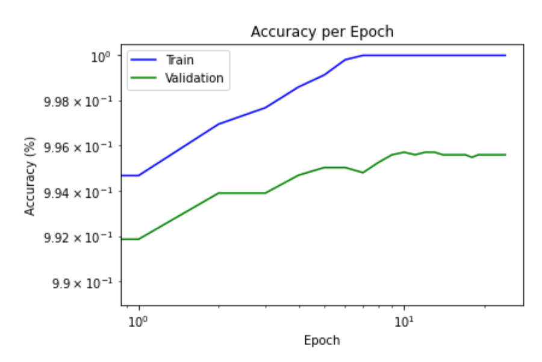
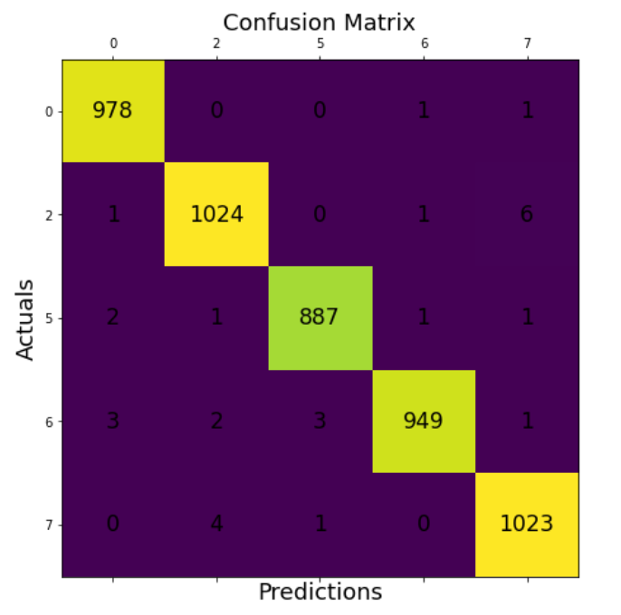

## Benchmarking Compression Algorithms

Initially, hyperparameter selections for L-step and μ-schedule were not providing satisfactory results to compress the reference neural network due to parameter miscalculation leading to overcompression. After adjustment, the L-step's hyperparameters were pinpointed to a learning rate of 0.2 and gamma value of 0.98. For the μ-schedule, an μ of 5(10^5) was initialized with an increase rate of 1.15x per step for a total of 30 steps. After analysis, 10 L-step epochs per iteration provided the best results. The figures below show the test errors from pruning, quantization, and low-rank compression algorithms.

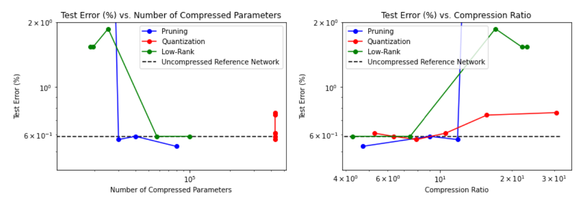

The figure below illustrates the test errors for quantization on codebook sizes of powers of 2 from 2 to 64 applied to every layer. Different values of associated compression parameters (codebook size for quantization, α for low-rank, and κ for pruning) were applied for each compression type to find a range of compression values. α used values from 10^-9 to 5(10^-8) and κ depended on the number of parameters the initial layer had.

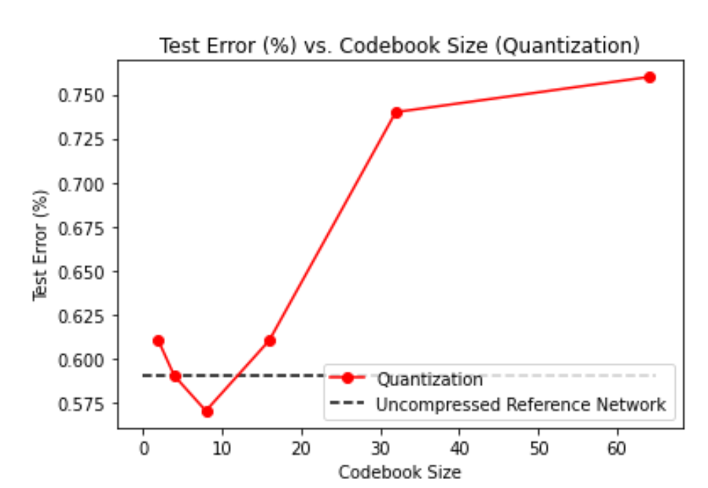

## Mixing Compression Algorithms

After benchmarking sole compression techniques, mixing them per layer type may minimize loss. In addition, this allows the observation of how different compression types behave at the start or end of neural networks since the first and last two are always convolutional and linear respectively. With this analysis, it is possible to maximize accuracy per layer to optimize the compressed model's performance.

### Linear Quantization and Convolutional Pruning

This compression scheme applies quantization to the linear layers and pruning to the convolution ones and returned one of the highest ratio of accuracy to compression ratio. The first layer's parameter count and both linear layers' codebook sizes can be low, allowing for a test error of 0.51% and a compression ratio of ~26.4. There were 104 parameters in the first convolutional layer, 2505 in the second, and a codebook size of 2 for both linear layers. Increasing the compression more would negatively impact the performance.

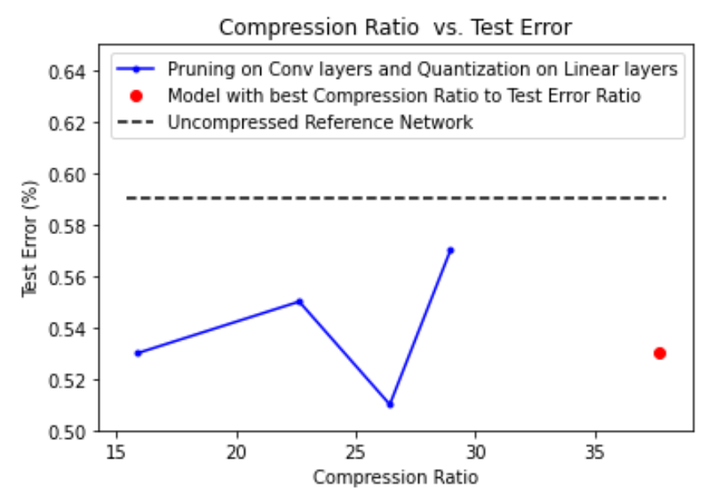
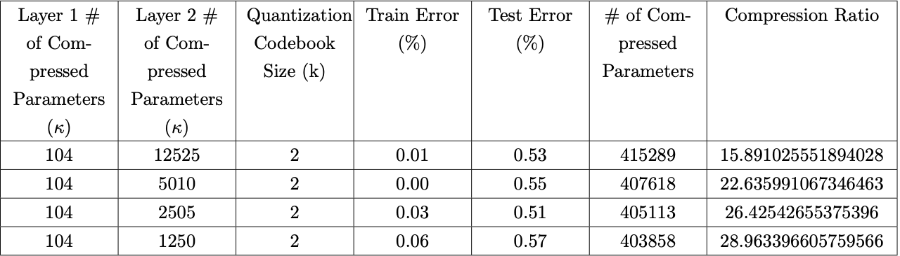

### Linear Low-Rank and Convolutional Quantization

This compression scheme returned high compression maintaining decent accuracy. Reducing the amount of compreession allowed the model to perform better with a relatively high compression ratio. Lowering the compression by a factor of 3 saw the error hardly decrease. Since the previous model performed better, tuning the hyperparameters more may waste resources.

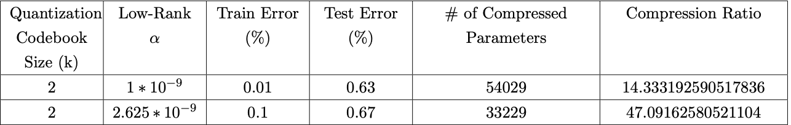

### Linear Quantization and Convolutional Low-Rank

With this compression scheme, we decided to keep the codebook size as 2 for the quantization of linear layers for all runs, since we have noticed that models tend to work pretty well with that type of compression. Here, we varied the amount of low-rank compression on the convolutional layers by changing the alpha value. There were no stand-out compressed models from this compression scheme, but the results are shown in Table 3.

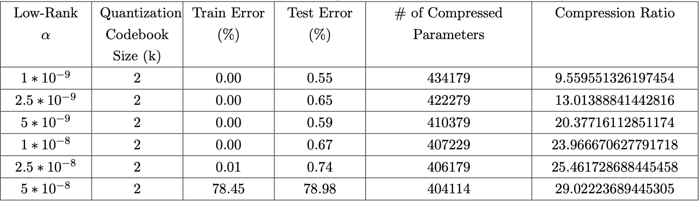

### Linear Pruning and Convolutional Quantization

Keeping the codebook at 2 for both convolutional layers, applying pruning with various parameters proportional to the number of starting parameters for each layer may increase performance, but it didn't. Lowering compression ratios returned higher error, with the best compressed model with this scheme returning an error of 0.78% at a compression ratio of only ~17. Therefore, the inverse must be true (proven above): **linear quantization and convolutional pruning** returns the best results, indicating that quantization is more effective on linear layers and pruning is more effective on convolutional layers.

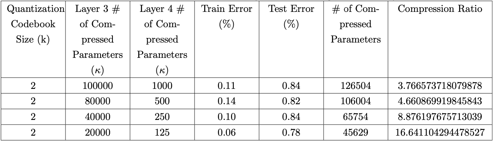

### Linear Pruning and Convolutional Low-Rank

As with the previous section, linear pruning performed worse, becoming unpredictable after compressing it at a ratio of 20.

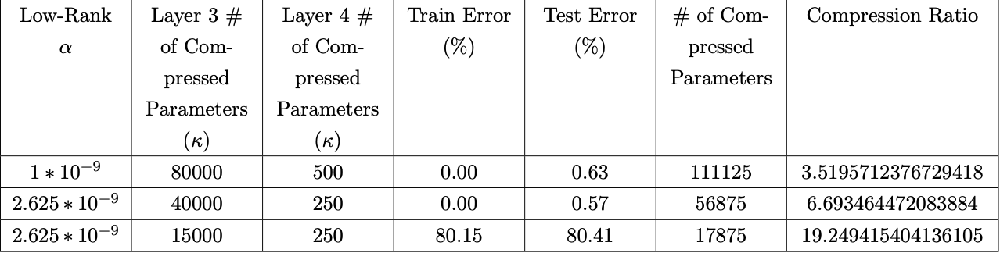

### Linear Low-Rank and Convolutional Pruning

This compression scheme returned the best ratio of compression to error, with 104 parameters in the first layer, 2505 parameters in the second layer, and an α of 2.5(10^−9) for linear low-rank compression. A compression ratio of 37.7 returned an error of 0.53%. The trend indicates that the best models were compressed with convolutional pruning.

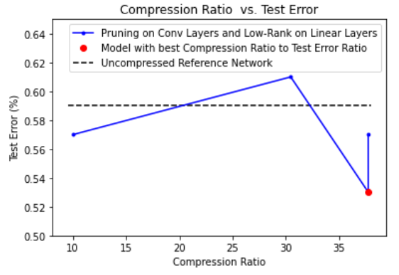
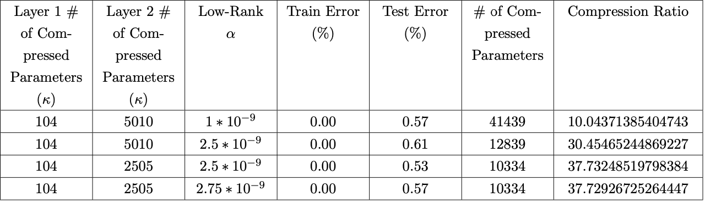

### 1 Model, 3 Compression Algorithms

As stated above, we started by setting the compression type for the convolutional layers to pruning, with 104 parameters for the first layer and 2505 for the second layer. We also kept the quantization codebook size at 2 for all runs, since this maximizes the compression ratio and didn’t seem to hurt accuracy much in previous experiments. That left us with only two free parameters: the α value for low-rank compression, and which of the linear layers to apply quantization or low-rank compression to. We tried both putting quantization first and putting low-rank first, and for each one we tried α values on the lower and higher range of what we had used for previous tests. For all tests, the resulting compression ratio to test error ratio wasn’t holding up to the models that we had found by just mixing two compression types. The results for the tests that we ran are below.

## Key Findings

The test error for our reference network improved from 1.33% to 0.53%. The charts below illustrate the change in model accuracy for various compression ratios per algorithm. All compression algorithms tended to increase as compression ratios increased. Key findings include that decreasing the amount of hyperparameters of initial convolutional layers increased performance (best compressed test error < reference error). Compressing the model with a ratio of 26 yielded the lowest test error at 0.51%, and compressing the model to 47 maintained 0.67 test accuracy. Our best model yielded an error of 0.53% with a compression ratio of ~37.7

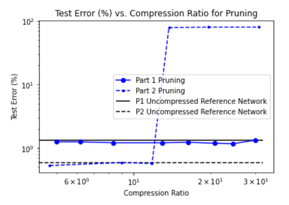
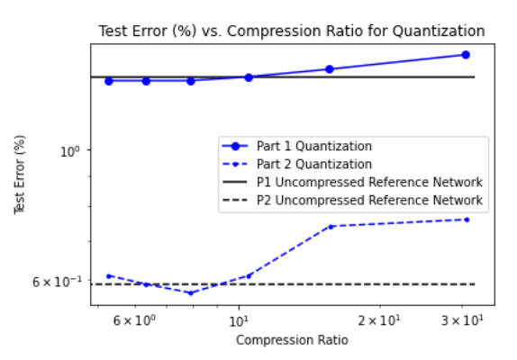
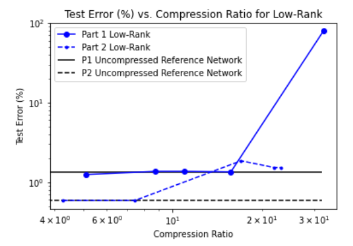
